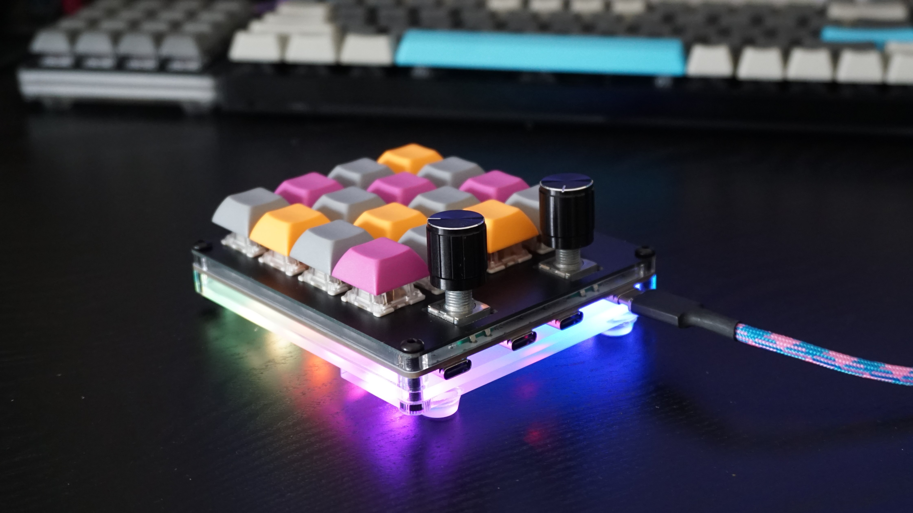

# Hub16

A macro pad with 16 keys, two rotary encoders, a four port USB hub, and plenty of LEDs!

This project started as I wanted to utilise rotary encoders to change the grid and trace size in KiCad, and then thought wouldn't it be nice to run a cable between the macro pad and keyboard, so a hub was added! 

It is designed to work with software on the host computer to enable powerful, context aware macros to be run, ensuring you never have to press a strange sequence of keys ever again. 

All design files required to manufacture the board and enclosure are located in this repo, along with assembled and tested boards being available from [Tindie](https://www.tindie.com/products/joshajohnson/hub16-programmable-macro-keyboard/). 

## Key Features
* 16 Cherry MX compatible switches, along with two switches in the encoders. 
* Two rotary encoders, bringing an intuitive interface for continuous controls such as grid size and volume.
* Four port USB 2.0 hub with Type-C connectors, allowing connection to other keyboards, memory sticks, wireless receivers and more! 
* Designed to interface with host computer to provide a level of interaction / macro control not available on standard keyboards, with examples provided for Windows, macOS, and Linux.
* Various case designs, allowing the Hub16 to fit in on any desk. 
* 11 individually addressable RGB LEDs. 
* Full QMK programmability and customisation. 

## Build Instructions
* [Keyboard Assembly](Documents/keyboard-assembly.md)
* [Firmware and Software Configuration](Documents/firmware-software-config.md) 

### Assembling the board from design files? 
* [PCB SMT Assembly Guide](Documents/smt-assembly.md)
* [Firmware Flashing Instructions](Documents/firmware-install.md)
* [Enclosure Manufacturing](Documents/enclosure-manufacturing.md)

### Errata / Changelog
* Boards purchased between June 12 and June 22 2020 will not go into the bootloader upon resting from software. Workaround: reset board with physical reset button under board. Fix: reflash the bootloader following [these instructions](Documents/firmware-install.md).

* Firmware builds prior to 27th June do not continually send characters when the encoders are depressed. Update to the latest firmware to resolve.
* Firmware builds prior to 9th June have issues with the bottom right key `p` not functioning correctly. Update to the latest firmware to resolve.

* Some rotary encoders output flipped signals (clockwise instead of counterclockwise), if after assembly your encoders appear to be sending the wrong signals, comment in line 84 in [config.h](Firmware/hub16/config.h), or alter the setting in your [software](Software).

* Long USB cables (> 2m) may not work with the keyboard. If the keyboard is not detected, or power cycles (can often be seen by LEDs flashing on and off), please try a shorter cable.

If you have any questions or comments please get in touch. I can be found on Discord as `_joshajohnson#9451`, [Twitter](https://twitter.com/_joshajohnson), and [r/mk](https://www.reddit.com/user/_joshajohnson). 

Happy typing!
